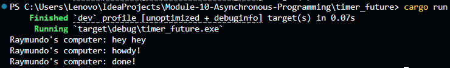
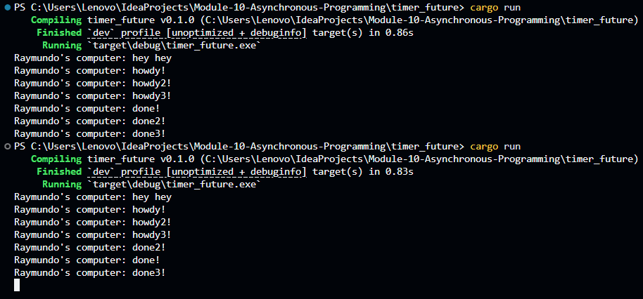

# Tutorial 1: Timer
## Experiment 1.2: Understanding how it works

The result is as such because the line `Raymundo's computer: hey hey` is printed before the timer future completes, showing that the main thread is not blocked while waiting for the timer to complete. The timer future is being executed on the executor, which is running concurrently with the main thread. First, it prints `Raymundo's computer: howdy!`, then waits for the timer to complete for two seconds, and finally prints `Raymundo's computer: done!`. This demonstrates that the main thread can continue executing other code while waiting for the timer to complete. This illustrates the asynchronous nature of the executor and how it allows for non-blocking execution of tasks. This enables the main thread to perform other operations while waiting for asynchronous tasks to complete. 

## Experiment 1.3: Multiple Spawn and removing drop

Both executions print three `howdy` messages, waits two seconds for the `TimerFuture`, and then print `done` messages. All of the three `howdy` messages appear before all of the three `done` messages because the `TimerFuture`s were pending each `done` messages for two seconds and only then they wake their task so that the executor can poll the task again.

The different is that for the first execution, where we did not remove the `drop` statement, the program stopped because the `Spawner` is disposed.

While for the second execution, where the `drop` statement is removed, the program did not stop (unless it was interrupted) because the `Spawner` is not disposed and still has a publisher side of the program structure and the executor's `ready_queue.recv()` execution keeps waiting for more tasks even after the three spawned tasks finished.